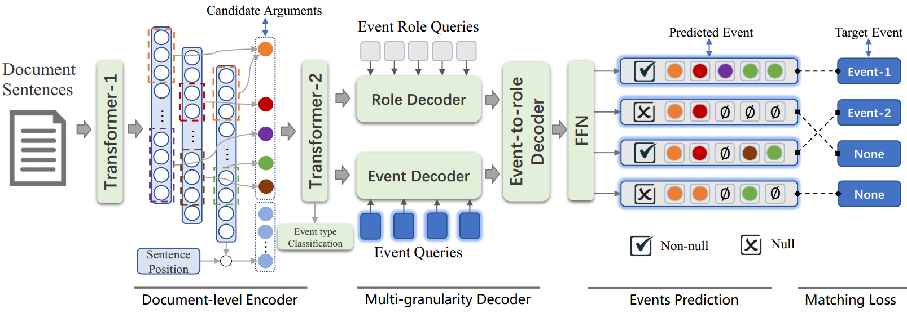

# Parallel Prediction for Document-level Event Extraction


Table of Contents
=================
  * [Overview](#overview)
  * [Data](#data)
  * [Reference](#reference)

## Overview
Code for the paper ["Document-level Event Extraction via Parallel Prediction Networks"](https://aclanthology.org/2021.acl-long.492/).
An updated complete code, in which part of the code (i.e. Data preprocessing, sentence-level extraction and evaluation metrics following Doc2EDAG[https://github.com/dolphin-zs/Doc2EDAG]).
A trained model can be downloaded via the link(https://pan.baidu.com/s/1iEfYEOUIzhOb4eH2OdM5ig\ password:u0h8) for evaluation.

Change `CUDA_VISIBLE_DEVICES` in `run.sh` and run:
```bash
# single GPU
$ bash run_single.sh

# multiple GPUs
## change `NUM_GPUS` and `CUDA` in `run_multi.sh`
$ bash run_multi.sh

# for evaluation
$ bash run_eval.sh
```
By setting a large step length of gradient accumulation, we can achieve large batch training with a few common GPUs. Specifically, for Titan X (12GB Memory), you should maintain B/(N*G) == 1,
where B, N and G denote the batch size, the number of GPUs, and the step size of gradient accumulation, respectively.

<p align="center">
  
</p>

## Dependencies 
- pytorch=1.6 
- transformers=3.1.0
- tensorboardX
- numpy
- tqdm

## Datasets
- ChFinAnn (Access from [https://github.com/dolphin-zs/Doc2EDAG/blob/master/Data.zip].

## Reference
```
@inproceedings{yang-etal-2021-document,
    title = "Document-level Event Extraction via Parallel Prediction Networks",
    author = "Yang, Hang  and
      Sui, Dianbo  and
      Chen, Yubo  and
      Liu, Kang  and
      Zhao, Jun  and
      Wang, Taifeng",
    booktitle = "Proceedings of the 59th Annual Meeting of the Association for Computational Linguistics and the 11th International Joint Conference on Natural Language Processing (Volume 1: Long Papers)",
    month = aug,
    year = "2021",
    address = "Online",
    publisher = "Association for Computational Linguistics",
    url = "https://aclanthology.org/2021.acl-long.492",
    doi = "10.18653/v1/2021.acl-long.492",
    pages = "6298--6308",
    abstract = "Document-level event extraction (DEE) is indispensable when events are described throughout a document. We argue that sentence-level extractors are ill-suited to the DEE task where event arguments always scatter across sentences and multiple events may co-exist in a document. It is a challenging task because it requires a holistic understanding of the document and an aggregated ability to assemble arguments across multiple sentences. In this paper, we propose an end-to-end model, which can extract structured events from a document in a parallel manner. Specifically, we first introduce a document-level encoder to obtain the document-aware representations. Then, a multi-granularity non-autoregressive decoder is used to generate events in parallel. Finally, to train the entire model, a matching loss function is proposed, which can bootstrap a global optimization. The empirical results on the widely used DEE dataset show that our approach significantly outperforms current state-of-the-art methods in the challenging DEE task. Code will be available at https://github.com/HangYang-NLP/DE-PPN.",
}
```